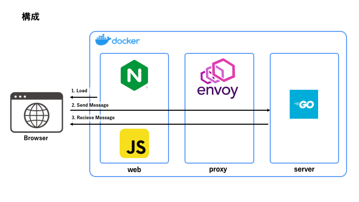

# grpc-web example

grpc-web を以下の条件で使った場合のテスト用に作成。  
[kui/grpc-web-cookie-test](https://github.com/kui/grpc-web-cookie-test) を参考に改変して作成しています。

- server: go 1.15
- client: Typescript 4.1
- envoyproxy API v3

## 構成



## 動作確認

```bash
# ログを見るために -d を省略して実行
$ docker-compose up --build

$ open http://localhost:8080
```

開いたページの 'greet' ボタンを押下するとサーバにメッセージが飛びます。

### cookie を設定する

developer tools の console で以下の様に入力すると設定できます。

```javascript
document.cookie = "key=value"
```

## 変更をする場合

### Proto ファイルの生成

#### requirements

- [buf](https://buf.build/)

#### 生成

```bash
$ go get -u google.golang.org/grpc

$ go get -u github.com/golang/protobuf/protoc-gen-go

$ yarn

$ buf generate
(generated)
```

以下に出力されます。

- golang: `server/`
- web: `web/src`

